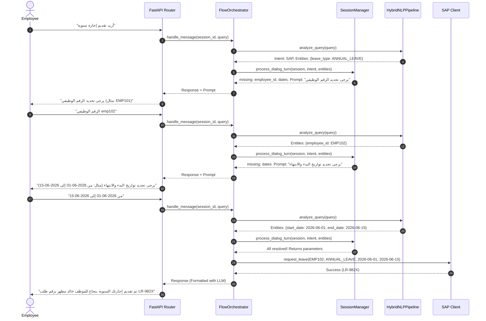

# AskHR

 **AskHR**، منصة الذكاء الاصطناعي المؤسسية لإدارة وتنسيق خدمات الموارد البشرية بمجموعة هائل سعيد أنعم (HSA Group). 

تمت إعادة هيكلة هذا النظام بالكامل وفق **المعمارية النظيفة (Clean Architecture / Ports & Adapters)** لضمان الاستقلالية التامة عن الأنظمة الخارجية، وتوفير مرونة فائقة تسمح بتغيير أي جزء برمجياً من الإعدادات دون تغيير منطق العمل الأساسي، ودعم المحادثات متعددة الحوارات وتعدد المستأجرين (Multi-tenancy).

---

## 🏗️ البنية المعمارية للنظام (System Architecture)

يعتمد النظام على فصل التبعيات إلى ثلاث طبقات رئيسية:
1. **طبقة الدومين (Domain Layer):** تحتوي على نماذج البيانات والمنافذ (Ports/Interfaces) كفئات مجردة لا تعتمد على أي أطر عمل خارجية.
2. **طبقة التطبيق (Application Layer):** تحتوي على حالات الاستخدام (Use Cases) ومنسق التدفق (`FlowOrchestrator`) ومدير الجلسات وحالة الحوار (`SessionManager`).
3. **طبقة البنية التحتية والمحولات (Infrastructure/Adapters):** تحتوي على التنفيذ الفعلي للواجهات مثل محول `Qdrant` للـ RAG، ومحول `SAP` للاتصال بـ SuccessFactors، ومحولات الـ NLP والـ LLM.

### 📐 مخطط بنية النظام (Ports & Adapters Diagram)

```mermaid
graph TD
    subgraph Infrastructure Layer (Adapters)
        FastAPI[FastAPI Router /api/v1/chat]
        InMemoryStore[InMemorySessionStore]
        OpenAILLM[OpenAICompatibleLLMClient]
        QdrantRetriever[QdrantRetrieverAdapter]
        SAPSF[SAPSuccessFactorsAdapter]
        HybridNLP[HybridNLPPipeline]
    end

    subgraph Application Layer (Use Cases)
        FlowOrch[FlowOrchestrator]
        SessionMgr[SessionManager]
    end

    subgraph Domain Layer (Pure Logic)
        Models[Domain Models]
        Interfaces[Ports/Interfaces]
    end

    FastAPI -->|calls| FlowOrch
    FlowOrch -->|calls| SessionMgr
    
    FlowOrch -->|implements interfaces| Interfaces
    InMemoryStore -.->|implements| Interfaces
    OpenAILLM -.->|implements| Interfaces
    QdrantRetriever -.->|implements| Interfaces
    SAPSF -.->|implements| Interfaces
    HybridNLP -.->|implements| Interfaces
```

---

## 💬 مخطط تدفق الحوار متعدد الأطراف (Multi-turn Dialog Sequence)

يوضح المخطط التالي كيف يسترجع النظام حالة الجلسة ويستعلم عن الحقول الناقصة تدريجياً (Slot Filling) حتى يكتمل الطلب ويتم رفعه لنظام SAP:



---

## 🚀 Setup & Installation (خطوات التثبيت والتشغيل)

### 1. تثبيت المكتبات المطلوبة (Install Dependencies)
افتح سطر الأوامر (PowerShell) في مجلد المشروع ونفذ:
```powershell
py -m pip install -r requirements.txt
```

### 2. إعداد المتغيرات والنموذج المحلي
- ضع نموذج Qwen GGUF في مجلد `services/llm_inference_service/models/`.
- قم بتهيئة ملف البيئة `.env` وانسخه من `.env.example`.
- اضبط التوكن وصلاحيات الـ JWT في `.env` عند الرغبة.

---

## 🏃 تشغيل الخدمات (Running the Services)

### الخطوة أ: تشغيل تغذية بيانات الـ RAG
لقراءة ملفات السياسات وتقطيعها وتخزينها في قاعدة بيانات Qdrant المحلية:
```powershell
py services/vector_db_service/data_ingestion.py
```

### الخطوة ب: تشغيل خادم الاستدلال المحلي (LLM Server)
```powershell
py services/llm_inference_service/server.py
```

### الخطوة ج: تشغيل خادم الأوركسترا الرئيسي (Orchestrator Server)
```powershell
py services/orchestrator_service/main.py
```
يعمل خادم الأوركسترا على الرابط: `http://127.0.0.1:8080` مع توفير واجهة تفاعلية Swagger على `http://127.0.0.1:8080/docs`.

---

## 🧪 تشغيل الاختبارات الآلية (Running Unit Tests)

يحتوي النظام على حزمة اختبارات شاملة تغطي دقة استخراج الكيانات، وفصل معمارية الدومين والتحكم بالجلسات. لتشغيل الاختبارات:
```powershell
py -m pytest
```

---

## 🔒 المزايا الأمنية والمؤسسية (Enterprise Security & Tenancy)
- **عزل المستأجرين (Tenant Isolation):** يقوم خادم الأوركسترا بقراءة `Tenant-ID` الممرر في توكن الـ JWT أو الـ API Key وتمريره بشكل تلقائي لسياق الجلسات ولعمليات استعلام قاعدة البيانات لضمان عدم تسريب البيانات بين شركات المجموعة.
- **إدارة صلاحيات JWT و RBAC:** دعم تقسيم المستخدمين إدارياً (employee, manager, hr_admin) وتقييد واجهات الخادم الحساسة (مثل مسارات تفريغ الجلسات أو التغذية الطارئة للبيانات).
- **التسجيل المهيكل (Structured Logging):** طباعة السجلات البرمجية بصيغة JSON مع حقن الـ `tenant_id` والـ `correlation_id` والـ `session_id` تلقائياً لتسهيل عمليات المراقبة والمتابعة عبر أنظمة ELK أو Datadog.
